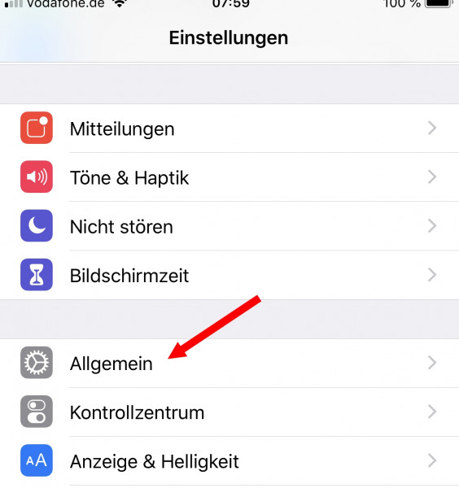

# Proxy instructions

**Important: This page is hard "Work in progress", and I explicitly request support in form of images that describe the process from an end user perspective and all infos. Please support!**

## General process

This library performs 2 functions:
* Running a proxy-server to perform a MITM attack (https://en.wikipedia.org/wiki/Man-in-the-middle_attack) to capture a tokenset
* Using the captured (or saved) tokens to communicate with Daikin Cloud

This file describes the first step.

## MITM-attack
### Starting the Proxy 
Prerequisites: the necessary options in `example.js` are configured according to your situation

* Start the `example.js` file. It opens two ports. 
1. One port for the proxy-server. This is the port you will configure on the client device's proxy settings (default: 8888).
1. The second provides an simple webpage to guide you through the process (default: 8889).
* Open the  webpage (http://ip_addr:8889 by default)

* Click on first link to download the certificate and enable it (see below for client device specific flow)
* When done click on the second Link to login to the Daikin Cloud
* After a successful login the browser should currently (to be optimized) show an error message (or simply stay on a Daikin page or show a blank page) because the last page is not possible to be opened by any browser. BUT if the console shows success that tokens were able to be catched we are already done!

Info: This library is not grabbing any username or password, just the created tokens after you logged in.

## Setting up client device

### Windows

Flow below was tested on Chrome and Edge.

#### Certificate

* Open the certificate manager: click Start and type 'Manage Computer Certificates'
* Open the folder 'Trusted Root Certification Autorities' and the subfolder 'Certificates'
* Right-click the 'Certificates' folder, select All Tasks, Import...
* Click Next and select the certificate (remove the file-extension filter!) and install

#### Proxy server

* Open the proxy server settings: click Start and type 'Proxy'
* Enable the proxy server settings and fill in the ip-address and port of the proxy server you are running. Finally hit save
* Continue the above flow by clicking the last link on the webpage. Afterwards, you can shut down the proxy server, remove the proxy settings from the Network settings and remove the certificate.

### macOS
  
  Warning: this project currently **does not work** on MacOS/Chrome. When visiting the Daikin website, a login-loop occurs. Please use Safari.
  
#### Certificate

* Open Keychain Access and select `System` on the lefthand side.
* Select File -> Import Items and select the `ca.pem` file. There will now be a `NodeMITMProxyCA`-certificate in the System keychain.
* Double click the certificate, open the Trust section and set 'When using this ceritficate' to 'Always Trust'

#### Proxy server

* Open System Preferences -> Network and select your network adapter.
* Click Advanced and navigate to the Proxies tab
* In the Proxies tab, select Secure Web Proxy (HTTPS) and fill in the ip-address and port of the proxy server you are running
* Continue the above flow by clicking the last link on the webpage. Afterwards, you can shut down the proxy server, remove the proxy settings from the Network settings and remove the certificate.
  

## For mobile Phones

### iOS

**Important: The Proxy is called "NodeMITMProxyCA" and no longer "Anyproxy" since 3.0.0!**

https://youtu.be/bHaL9ftU2zc

#### Install Certificate

**Not done yet!** Make sure iOS fully trusts the certificate. 
You can check and configure this setting at Settings > General > About > Certificate Trust Settings.

#### Enable Proxy

### Android

https://youtu.be/bHaL9ftU2zc?t=275

**Important: The Proxy is called "NodeMITMProxyCA" ... Screens needs to be updated**

**Important: Some newer Android versions might NOT allow the self signed certificates anymore at all! So if you are sure you did anything correctly, and it is still not working or only SSL errors are in the logs then please try an Android Emulator (see below)!**

#### Install certificate

Depending on your Android version an installation of the Certificate for "VPN and Apps" OR "Wifi" is needed. AN easy way is to just install it twice (once for both modes) :-)

#### Enable PROXY

